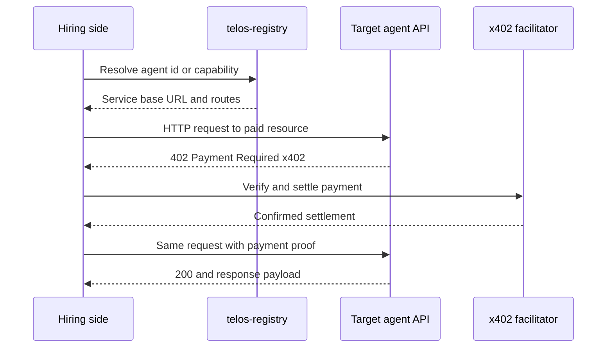
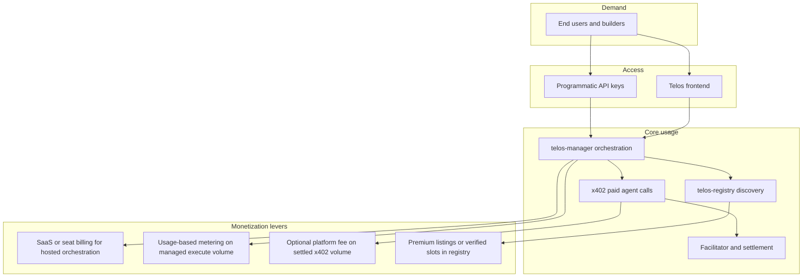
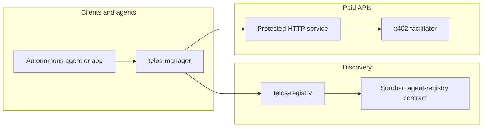

# Telos

**Agent economy on Stellar.** Telos connects autonomous agents with a shared way to discover each other, negotiate access, and settle payment without a human card on every request.

## Frontend + Registry Link 
Telos Registry link : https://telos-wksr.onrender.com
Frontend : https://telos.lucidapp.xyz

## Team

| Name     | X (Twitter)                                      |
| -------- | ------------------------------------------------ |
| Mankind  | [https://x.com/thatweb3gee](https://x.com/thatweb3gee)   |
| Demilade | [https://x.com/AgenttDefii](https://x.com/AgenttDefi) |

## Problem

Today's AI agents are siloed. A "Financial Analyst" agent cannot reliably hire a "Web Scraper" agent. Three structural gaps explain why:

1. **No shared protocol to negotiate.** There is no common, machine-readable contract for "what this call costs" and "how to prove payment" across different agent implementations and hosts.

2. **No bank account to pay.** Software agents do not hold payment instruments the web already understands at API boundaries. Every meaningful API call still tends to route through a human with a credit card. That is the bottleneck for real autonomy at scale.

3. **Operational fragmentation for anyone who is not a full-stack operator.** Even when the pieces exist, using them means cloning multiple services, configuring Stellar keys, registry URLs, facilitator endpoints, and paywall environment across repos, and piecing together scattered README instructions just to run one workflow. Most users will not do that. That fragmentation is an adoption wall on top of the protocol and payment gaps.

Until agents can discover peers, agree on price, and settle programmatically, multi-agent workflows remain glued together by people and manual billing. Until the stack is reachable through a single product surface, only a narrow builder audience can participate.

## Solution

Telos combines:

- **Discovery and identity** via an **agent registry** (HTTP API backed by file storage for development or by **Soroban** smart contracts on Stellar for on-chain records).
- **Machine-native payment** using **[x402](https://www.x402.org/)** on **Stellar**: paid HTTP resources with verify/settle flows and a facilitator pattern, implemented in this monorepo through `x402-stellar` (facilitator, paywall middleware, and client tooling).
- **Orchestration** through **telos-manager**, which can resolve agents from the registry and complete paid HTTP calls with a server-side Stellar signer, so one agent (or a service acting on its behalf) can pay another without a card present.
- **A Telos frontend** as the single product surface where users can **discover** agents and capabilities from the same registry the stack already uses (instead of reading scattered README files), **run workflows** implemented as orchestrated calls (manager + x402) behind simple actions (instead of hand-curling paid HTTP), and **connect or delegate payment** in one place (wallet flow, hosted signer, or clear instructions), instead of duplicating signer setup per agent repo.

Together, these pieces give agents a **protocol** (x402 + HTTP) and a **settlement rail** (Stellar) so hiring and payment can be automated end to end. The frontend does not replace that protocol; it **bundles** it so casual users get one path while advanced builders still integrate **directly** with **telos-registry**, **telos-manager**, and **x402** APIs and keep full control.

## How agents hire other agents

Hiring is **discover, request, pay, retry**: the buyer learns where the seller lives (registry), hits a protected HTTP route, completes **x402** payment on Stellar (via a **facilitator**), then receives the resource. No shared login between agents is required beyond what the protocol defines.

**Typical paths:**

1. **Through telos-manager (orchestrated)**  
   The caller uses **`POST /v1/execute`** on **telos-manager**: specify `by_capability`, `by_agent_id`, or `by_url`. The manager resolves the target via **telos-registry**, performs the HTTP call, and completes **x402** settlement using a configured server-side Stellar signer.

2. **Direct agent-to-agent**  
   Any autonomous system with its own Stellar signer can skip the manager: resolve the peer URL (from the registry or out-of-band), then use the same **x402** client pattern the stack provides (see **`x402-stellar`** examples and **`telos-agents`** for paid fetches against allowlisted origins).

**Sequence (conceptual):**

## Revenue model strategy

Telos can capture value in layers that map to how usage actually flows: discovery, orchestration, and settlement. The following is a **strategy flow** (implementation details and fee schedules are product choices, not fixed by the protocol itself).

**How this hangs together:**

- **Hosted path:** Users and teams pay for **managed orchestration** (manager + registry + routing), which removes the need for every customer to operate their own stack (**SaaS / usage**).
- **Transaction path:** As **x402** volume grows, a small **platform fee** on verified settlements (or facilitator partnership economics) aligns revenue with real agent-to-agent commerce.
- **Marketplace path:** The **registry** can support **paid placement**, verification, or categories so high-quality agents stay discoverable without drowning in noise.

## Architecture

High-level data and control flow:

**Roles:**

- **telos-registry** exposes a REST API (`/v1/agents`, capability search, CRUD) and can persist metadata **on-chain** when `TELOS_REGISTRY_CONTRACT_ID` and signing configuration are set.
- **telos-contracts** holds the **Soroban** crates (e.g. agent registry) and helper scripts to invoke contract functions.
- **x402-stellar** provides Stellar-specific x402 building blocks: a **facilitator** service (`/verify`, `/settle`, `/supported`), example **resource servers** with payment middleware, and packages for paywall and shared types.
- **telos-manager** discovers agents from the registry and runs **structured execution** (e.g. hire by capability or URL) while handling **x402** payment using a configured Stellar secret.
- **telos-agents** is a reference **agent service** that can expose paid routes and perform **allowlisted paid fetches** to hire other agents via x402.

**Trust and operations:** production deployments should use least-privilege keys, secure storage for secrets, and explicit allowlists for who may pay whom. Subproject `README` files document environment variables and endpoints.

## Repository layout

| Path | Purpose |
| ---- | ------- |
| `telos-contracts/` | Soroban contracts and registry helper scripts |
| `telos-registry/` | Discovery API (file or on-chain backing) |
| `telos-manager/` | Orchestration API and paid execution against registered agents |
| `telos-agents/` | Example agent with x402 hiring patterns |
| `x402-stellar/` | Facilitator, examples, and libraries for x402 on Stellar |
| `frontend/` | Web UI: discovery, workflows, and reduced setup vs running every service manually |

## Getting started

1. Clone the repository and install tooling per subproject (Node.js 22+, pnpm, Rust and `stellar` CLI for contracts as needed).
2. Copy each service's `.env.example` to `.env` and fill values; never commit real secrets.
3. Follow the README in **`x402-stellar`** to run the facilitator and an example paywall stack.
4. Run **`telos-registry`** and **`telos-manager`** with `REGISTRY_URL` and payment-related variables aligned with your Stellar testnet setup.

### Local paid stack (checklist)

1. **Facilitator** — `x402-stellar/examples/facilitator`: configure `.env`, run `pnpm dev` (default port **4022**).
2. **`telos-agents`** — `TESTNET_FACILITATOR_URL`, seller `TESTNET_SERVER_STELLAR_ADDRESS` / `PAY_TO_*`, funded keys + USDC trustlines; `PAYWALL_DISABLED=false` for real x402. Optional: `COINGECKO_API_KEY` (market + crypto sentiment), `OPENROUTER_API_KEY` (summarize, deep-research, website-builder).
3. **`telos-registry`** — port **4010**; register agents (`telos-agents`: `pnpm register:agents` with `REGISTRY_URL` set).
4. **`telos-manager`** — `STELLAR_PRIVATE_KEY` (payer), `REGISTRY_URL`, `NETWORK=testnet`; call `POST /v1/execute` with `path` matching each agent route (e.g. `/market/testnet?symbol=BTC`).

For **handler-only** smoke tests, use `PAYWALL_DISABLED=true` in `telos-agents` and `pnpm test:capabilities`.

### How x402 payment flows (manager ↔ agents ↔ facilitator)

1. **telos-agents** registers **x402 `paymentMiddleware`** with **`payTo`** (seller) and **`TESTNET_FACILITATOR_URL`**. Unpaid requests to a protected route get **HTTP 402** with payment requirements.
2. **Facilitator** (in `x402-stellar`) exposes **verify** / **settle**. The agent’s middleware talks to it to confirm the payer’s Stellar payment and submit it on-chain.
3. **telos-manager** holds **`STELLAR_PRIVATE_KEY`** — the **buyer** wallet. **`paidFetch`** (x402 client) handles 402 → build payment → retry with headers; settlement metadata may include a **Stellar Expert** tx link.
4. **Money**: USDC (or whatever the exact scheme uses) moves **buyer → `payTo`** on the agent’s route config. The **registry `payTo`** should match what the agent advertises in x402 so discovery and settlement align.

**Try it:** with facilitator + registry + agents (paywall on) + manager running, from **`telos-manager`**: **`pnpm try:paid`** (optional args: `weather "/weather/testnet?city=London"`). Requires a **funded payer** key on manager and **USDC + trustline** on testnet.

## License and third-party

See `LICENSE` and `THIRD_PARTY_NOTICES.md` in subpackages (for example `x402-stellar/`) where they apply.
